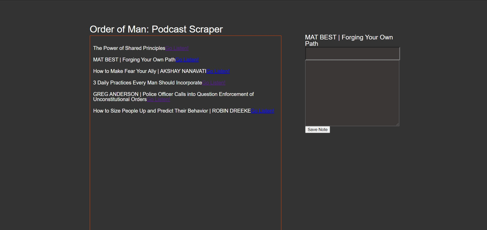

# mongo-scraper

<a href = "https://mongo-claywhill.herokuapp.com/">Link to project</a>

## Usage
1. Clone the repo
1. npm install

## Tech Used
* JavaScript
* Node.js
* MongoDB

* **Packages**
  * [Axios](https://www.npmjs.com/package/axios)
  * [Cheerio](https://www.npmjs.com/package/cheerio)
  * [Express](https://www.npmjs.com/package/express)
  * [Mongoose](https://www.npmjs.com/package/mongoose)
  * [Morgan](https://www.npmjs.com/package/morgan)

## What this app does
This app uses cheerio to pull targeted elements from a website. Those elements then get stored in a Mongo database. The elements are then displayed in the browser. The user can then add a note to any of the elements and it will be saved in the database.
